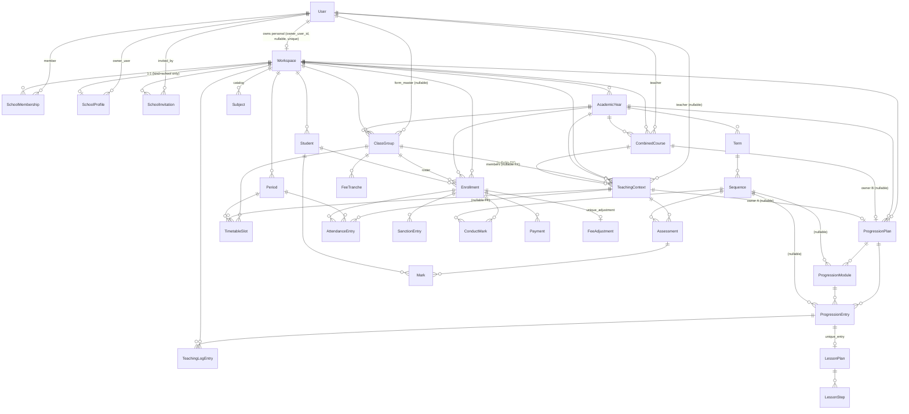

# TeacherAssistant — Architectural Analysis (2026-09-23, `main` @ 1fc5547)

Read-only review of structure, boundaries, data model, tenancy, authorization and code health. All paths are relative to `/Users/franckstfiler/Documents/projects/teacher-assistant`. Line numbers are from the current tree.

---

## 1. SYSTEM OVERVIEW

### Layers

| Layer | Where | Notes |
|---|---|---|
| Web (LiveView + a few controllers) | `lib/teacher_assistant_web/live/{teacher,school,onboarding,admin}`, `controllers/` | 4 `ash_authentication_live_session`s in `router.ex:76-127`. Scope built per-mount by `LiveUserAuth.assign_scope` (`live_user_auth.ex:82-97`). |
| Scope / session glue | `lib/teacher_assistant/scope.ex`, `accounts/workspaces.ex`, `accounts/permissions.ex` | Plain structs + functions; not Ash. `Scope` implements `Ash.Scope.ToOpts` but returns `:error` for tenant and authorize? (`scope.ex:41-47`) — i.e. it is never used as an Ash scope in practice. |
| Domain modules (9 Ash domains + orchestration) | `lib/teacher_assistant/{organization,enrollment,curriculum,assessment,attendance,discipline,fees,timetabling,accounts}.ex` | Each is `use Ash.Domain` **and** a hand-written context module with 10–60 public functions. `curriculum.ex` is 961 lines. |
| Resources | `lib/teacher_assistant/academics/*.ex` (27) + `lib/teacher_assistant/accounts/*.ex` (5) | All AshPostgres; 32 resources; 33 migrations. |
| Pure calculation | `academics/{marks,bulletins,coverage,fee_balance,quota,module_grouping,conduct}.ex` | Zero Ash/Repo references, each has a test file. |
| Reference data / seeding | `academics/{reference,school_templates,seeding}.ex` | Module attributes as data; `seeding.ex` is the only one that writes. |

### Domains and their resources (as declared in `resources do` blocks)

| Domain module | Resources declared |
|---|---|
| `TeacherAssistant.Accounts` (`accounts.ex:9-30`) | User, Token, SchoolMembership, SchoolInvitation, SchoolProfile |
| `TeacherAssistant.Organization` (`organization.ex:22-35`) | Workspace, AcademicYear, Term, Sequence |
| `TeacherAssistant.Enrollment` (`enrollment.ex:10-22`) | ClassGroup, Student, Enrollment |
| `TeacherAssistant.Curriculum` (`curriculum.ex:26-70`) | Subject, TeachingContext, CombinedCourse, ProgressionPlan, ProgressionEntry, ProgressionModule, TeachingLogEntry, LessonPlan, LessonStep |
| `TeacherAssistant.Assessment` (`assessment.ex:23-26`) | Assessment, Mark |
| `TeacherAssistant.Attendance` (`attendance.ex:23-30`) | Period, AttendanceEntry |
| `TeacherAssistant.Discipline` (`discipline.ex:18-32`) | SanctionEntry, ConductMark |
| `TeacherAssistant.Fees` (`fees.ex:18-38`) | FeeTranche, FeeAdjustment, Payment |
| `TeacherAssistant.Timetabling` (`timetabling.ex:15-17`) | TimetableSlot |

**Is the split real or cosmetic?** Real at the Ash level, cosmetic at the code level:

- Real: each resource is declared in exactly one domain and Ash routes actions through it; the 2026-09-18 sweep did move the god-domain into nine `Ash.Domain`s with `authorize :when_requested` each.
- Cosmetic: **every resource module still lives under `TeacherAssistant.Academics.*`** (27 files) — the spec's "module namespaces follow the domain" (`2026-09-18 §1`) was not done. Consequences: `TeacherAssistant.Assessment` (domain) vs `TeacherAssistant.Academics.Assessment` (resource) and the same for `Enrollment` produce name collisions that the domain modules have to warn about in comments (`assessment.ex:4-8`, `attendance.ex:10`, `discipline.ex:7`, `fees.ex:7`). Cross-domain reaching is pervasive: `Curriculum` calls `Enrollment.list_students` (`curriculum.ex:406`), `Assessment` calls `Curriculum.list_assignments_for_class` and `Enrollment.list_students` (`assessment.ex:213,241`), `Enrollment.delete_class_group` queries `TeachingContext` directly (`enrollment.ex:66-69`), `Scope.setup_complete?` calls `Enrollment.list_class_groups` (`scope.ex:31-35`). There is no dependency direction; the domains are a partition of files, not a set of boundaries.

### How the web layer reaches the domain

Three styles coexist:

1. **Hand-written domain functions** (dominant): e.g. `Enrollment.fetch_owned_class_group/2`, `Fees.record_payment/3`, `Assessment.upsert_marks/2`. Called from LiveViews with plain structs; **no scope/actor is ever passed** (`grep -rn "actor:" lib` returns nothing outside auth overrides).
2. **`code_interface` defines** on the domain (`organization.ex:23-31`, `curriculum.ex:27-70`, `enrollment.ex:11-21`): `get_course`, `get_teaching_context`, `get_academic_year`, `update_class_group`, `unit_plans`… Several are unscoped `get_by: [:id]`, see §3.
3. **Generic actions** (`Ash.ActionInput.for_action |> Ash.run_action`) for transactional multi-record work: `Enrollment.:enroll_new`, `Mark.:upsert_all`, `ProgressionPlan.:import`/`:apply_layout`, `CombinedCourse.:combine`/`:split`, `AttendanceEntry.:record_combined_period`, `TimetableSlot.:place_combined`. This is the idiomatic part and is well done.

Controllers (`bulletin_print_controller.ex:33-56`, `timetable_print_controller.ex`, `fiche_print_controller.ex`) rebuild the scope from the session by hand (`Workspaces.scope_for(user, get_session(conn, :workspace_id), nil)`) — 8 sites each with their own `load_user/1` copy (`grep "defp load_user" lib/teacher_assistant_web` = 16 definitions across 8 files).

---

## 2. DATA MODEL

### ER diagram (built from `belongs_to`/`has_many` declarations; `mix ash.generate_resource_diagrams -t er` ran, generated per-domain `.mmd` files under `lib/teacher_assistant/`, which were read for relationships and then deleted — tree is clean)

### Resource table

Tenancy column legend: **FK** = `belongs_to :workspace`; **raw** = `attribute :workspace_id, :uuid` with no relationship/FK constraint; **none** = no workspace column, reachable only through a parent chain. No resource uses Ash `multitenancy` (grep returns nothing); no resource uses `AshArchival`; no resource uses `AshStateMachine`.

| Resource (`academics/` unless noted) | table | key attributes | belongs_to | identities | tenancy | archival | state machine |
|---|---|---|---|---|---|---|---|
| Workspace | workspaces | name, kind(enum personal/school) | owner_user (nullable) | unique_owner_user[owner_user_id] (`workspace.ex:108`) | — (is the tenant) | no | no |
| accounts/SchoolProfile | school_profiles | school_type, subsystem, sector, region, town, verification_status(enum), verified_at, verified_by_user_id(raw uuid), logo_path… | workspace, owner_user | unique_workspace[workspace_id] | FK | no | hand-rolled verify/reject actions |
| accounts/SchoolMembership | school_memberships | roles {array,SchoolRole}, **status (nullable enum) AND active (bool)** (`school_membership.ex:62-63`) | workspace, user | unique_member[workspace_id,user_id] | FK | no | no |
| accounts/SchoolInvitation | school_invitations | email ci, roles, status, membership_status, token, expires_at | workspace, invited_by_user | unique_token | FK | no | no |
| accounts/User | users | email, role(UserRole global), name, hashed_password | — | unique_email | — | no | no |
| AcademicYear | academic_years | name, start/end, active(bool) | workspace | unique_workspace_year[workspace_id,name] | FK | no | no |
| Term | terms | position | academic_year | unique_year_term | none | | |
| Sequence | sequences | number, position_in_term, start/end, integration_week | term | — (no identity) | none | | |
| Subject | subjects | name, code, default_coefficient, category(enum), position, active? | workspace | unique_subject_name[ws,name] | FK | soft `active?` | |
| Period | periods | position, label, start/end_time, kind(enum) | workspace | unique_period_position | FK | | |
| ClassGroup | class_groups | label, level, serie, subsystem(enum), form_master_user_id | workspace, academic_year, form_master | unique_class_group[ws,year,label] | FK | | |
| Student | students | full_name, sex, matricule | workspace | none (custom unique partial index on [ws,matricule] `student.ex:12-17`) | FK | | |
| Enrollment | enrollments | status(enum), repeater | student, class_group, academic_year, workspace | unique_enrollment_per_year[student,year] | FK | | |
| TeachingContext | teaching_contexts | **subject (string), level, serie, subsystem** (denormalized from ClassGroup/Subject), weekly_hours, coefficient, annual_hours, target_*; combined_course_id | workspace, academic_year, class_group(**nullable**), teacher(**nullable**), combined_course(nullable) | none (only custom indexes, `teaching_context.ex:12-25`) | FK | | |
| CombinedCourse | combined_courses | subject(string), label, teacher_user_id | workspace, academic_year, teacher | none | FK | | |
| ProgressionPlan | progression_plans | title, **status :atom** (`:269`), template(bool) | teaching_context(**nullable**), combined_course(**nullable**), academic_year, workspace | none | FK | | validation ExactlyOneOwner (`:262`) |
| ProgressionModule | progression_modules | title, position, default?, credit_hours | progression_plan, sequence(nullable) | none | none | | |
| ProgressionEntry | progression_entries | lesson_title, planned_hours, **entry_type :atom** (`:74`), week_no, completed?, position, CBA fields | progression_plan, sequence(nullable), progression_module | none | none | | |
| TeachingLogEntry | teaching_log_entries | date, content_taught, hours, **status :atom** (`:66`), homework, note | workspace, progression_entry | none | FK | | |
| LessonPlan | lesson_plans | lesson_date, duration_minutes, titre, competence_attendue… | progression_entry | unique_entry | none | | |
| LessonStep | lesson_steps | position, etape, contenus… | lesson_plan | none | none | | |
| Assessment | assessments | label, weight, max_score, given_on | teaching_context, sequence | none | none | | |
| Mark | marks | score (nullable=absent) | assessment, student | unique_mark[assessment,student] | none | | PubSub notifier (`mark.ex:82-86`) |
| AttendanceEntry | attendance_entries | date, status(enum), justified, justification_note, recorded_by_user_id | enrollment, period, teaching_context(**nullable**) | unique_mark[enrollment,date,period] (copy-paste name, `:246`) | **raw** (`:220`) | | |
| TimetableSlot | timetable_slots | day(enum) | class_group, teaching_context, period | unique_cell[class,day,period] | **raw** (`:170`) | | |
| FeeTranche | fee_tranches | label, amount(int), due_date, position | class_group | none | **raw** (`:59`) | | |
| FeeAdjustment | fee_adjustments | amount, reason, recorded_by_user_id | enrollment | unique_adjustment[enrollment] | **raw** (`:57`) | | |
| Payment | payments | amount, paid_on, method(enum), reference, note, recorded_by_user_id | enrollment | none | **raw** (`:75`) | | |
| SanctionEntry | sanction_entries | type(enum), date, reason, duration_days, issued_by_user_id | enrollment | none | **raw** (`:81`) | | |
| ConductMark | conduct_marks | value, recorded_by_user_id | enrollment, sequence | unique_conduct_mark | **raw** (`:66`) | | |

### Concept notes

- **Workspace (kind personal|school) vs SchoolProfile.** `Workspace` is the tenant anchor for both modes; `owner_user_id` is set only for personal workspaces and is what `unique_owner_user` enforces (`workspace.ex:96-108`). Schools are `kind: :school`, `owner_user_id: nil`, ownership lives on `SchoolProfile.owner_user_id` (`school_profile.ex:146`). The school is created atomically via `Workspace.:create_school` after_action (`workspace.ex:50-74`) — profile, `:head` membership, seeded subject catalog. Good.
- **TeachingContext = teacher × subject × class × year**, but every axis except year/workspace is nullable or a string: `class_group_id` nullable (personal mode has no class), `teacher_user_id` nullable (personal mode has no user link), `subject` a denormalized string (spec decision 2026-09-17 §1), `level/serie/subsystem` copied from the class. It is the pivot for marks, timetable, attendance, plans and coverage.
- **CombinedCourse** links N contexts (same teacher+subject) by stamping `combined_course_id`; a course owns one ProgressionPlan. `TeachingContext` declares `combined_course_id` both as an attribute (`:178`) and as a `belongs_to` with `define_attribute? false` (`:208-213`) — works, but the same double-declaration pattern is used for `ClassGroup.form_master_user_id` (`class_group.ex:76,94-99`), `CombinedCourse.teacher_user_id`, `ProgressionPlan.combined_course_id`.
- **ProgressionPlan dual ownership**: two nullable FKs + a custom validation (`progression_plan/exactly_one_owner.ex:12-30`) rather than a DB constraint; the `:unit_plans` read (`progression_plan.ex:43-53`) filters stale pre-combine plans in Elixir-side expr. The "teaching unit" abstraction (`{:solo, ctx} | {:course, course}`) is reconstructed in `Curriculum.list_units_for_user` (`curriculum.ex:343-363`) by N+1 `get_course` calls.
- **Roster** = `Enrollment` rows (student × class × year), with `Student` workspace-scoped and matricule unique per workspace. Marks hang off `Student` (not `Enrollment`), while attendance/fees/discipline hang off `Enrollment` — two different "who is this row about" keys for the same person in the same year. Bulletins therefore join marks (by student_id) to roster (by enrollment) in Elixir (`assessment.ex:230-260`).
- **Term/Sequence/AcademicYear**: only `AcademicYear` carries `workspace_id`; `Term`/`Sequence` are reachable only through the year. `AcademicYear.active` is a bool with no uniqueness guard (activate action presumably toggles others; `organization.ex:118-122` takes `List.first`).
- **Period/TimetableSlot**: `Period` is per-workspace (not per-year); slots are per class×day×period with teaching_context. Attendance resolves the slot at record time (`attendance.ex:108-119`) to find the context.
- **Fees**: tranche per class, payments/adjustment per enrollment, balance computed in pure `FeeBalance`. Amounts are integer FCFA. Money formatting lives in the web layer (`teacher_assistant_web/money.ex`).

### Modeling smells

1. **Nullable FKs as mode discriminators**: `TeachingContext.class_group_id` / `teacher_user_id` nil ⇒ "personal teacher mode"; `ProgressionPlan.teaching_context_id` vs `combined_course_id` ⇒ "solo vs course"; `AttendanceEntry.teaching_context_id` nil ⇒ "no timetable slot". The 2026-09-23 spec's own risk section calls these out as hazards for policy resolution.
2. **Dual-mode resources**: `Workspace` (personal vs school), `TeachingContext` (free-typed vs catalog-backed), `Enrollment` domain has `add_student` (personal) and `enroll_new` (school) doing the same thing with different return shapes (`enrollment.ex:190-210`).
3. **Missing identities**: `Sequence` (no [term_id, number]), `Assessment` (no [context, sequence, label]), `TeachingContext` (no identity — the spec's "a context belongs to at most one course" and "one context per teacher×subject×class×year" are enforced only by custom indexes + Elixir checks), `CombinedCourse`, `Payment`, `SanctionEntry`. `AcademicYear.active` has no "one active per workspace" constraint.
4. **Missing/inconsistent tenancy scoping**: 7 resources carry `workspace_id` as a bare uuid attribute with **no FK and no relationship** (AttendanceEntry, TimetableSlot, FeeTranche, FeeAdjustment, Payment, SanctionEntry, ConductMark); 8 resources have no workspace column at all (Term, Sequence, Assessment, Mark, ProgressionEntry, ProgressionModule, LessonPlan, LessonStep). Nothing prevents a Payment row whose `workspace_id` disagrees with its enrollment's workspace.
5. **Denormalization**: `TeachingContext.{subject,level,serie,subsystem}` duplicate `Subject.name` and `ClassGroup.{level,serie,subsystem}`; `CombinedCourse.subject` duplicates again; renames don't cascade (accepted in spec 2026-09-17, but now three copies).
6. **Enum sprawl / bare atoms**: 19 `Ash.Type.Enum` modules; 3 attributes still bare `:atom` with inline constraints (`progression_plan.ex:269`, `progression_entry.ex:74`, `teaching_log_entry.ex:66`) — violates the project's own rule (memory: "never use bare :atom"). Two subsystem enums (`Academics.Subsystem` for classes, `Accounts.SchoolSubsystem` with `:bilingual` for schools). `SchoolMembership` has both `status` (nullable enum) and `active` (bool).
7. **Copy-paste identity name**: `AttendanceEntry` identity is called `unique_mark` (`attendance_entry.ex:246`).
8. **Legacy snapshot**: `priv/resource_snapshots/repo/personal_workspaces/` still exists beside `workspaces/` — a renamed table's history, harmless but confusing.

---

## 3. TENANCY & SCOPE

### How a request is scoped

1. Session holds `user_id`, `workspace_id`, `context_id`, `locale` (`live_user_auth.ex:12-19`). Workspace is chosen by `GET /workspaces/select/:id` (`workspace_controller.ex:7-25`) which validates via `Workspaces.scope_for` then `put_session(:workspace_id)`.
2. On every LiveView mount, `assign_scope` (`live_user_auth.ex:82-97`) loads the user by id and calls `Workspaces.scope_for(user, workspace_id, context_id)` (`workspaces.ex:7-20`), which:
   - fetches the workspace by id with `Organization.get_personal_workspace` (misnamed — it is a generic get-by-id, `organization.ex:25`),
   - for `:personal` requires `owner_user_id == user.id` (`workspaces.ex:23`),
   - for `:school` requires an active `SchoolMembership` (`workspaces.ex:45`), then loads roles, active year, verification status, and the assigned teaching context.
   - Failure ⇒ `%Scope{current_user: user}` with nil workspace (`live_user_auth.ex:113-116`), not a halt.
3. `on_mount` hooks: `:live_user_required` (auth), `:require_teaching_scope` (school members must have an assigned context to use `/teacher/*`, `live_user_auth.ex:45-53`), `:require_school_setup` (year+classes exist, `:55-70`), `:require_operator` (global `UserRole == :admin`, `:37-43`).
4. Controllers rebuild scope themselves from the session (`bulletin_print_controller.ex:34-37` etc.).

### Where is workspace_id enforced?

**Not at the data layer.** There is no Ash `multitenancy` block anywhere, `Scope.get_tenant/1` returns `:error` (`scope.ex:43`), and every policy is `authorize_if always()` (32 resource files). Enforcement is by convention:

- Read actions with explicit `workspace_id` arguments: `:owned` on ClassGroup/Student/TeachingContext/ProgressionPlan/ProgressionEntry/ProgressionModule (`class_group.ex:37-42`, `teaching_context.ex:89-93`, `progression_plan.ex:65-69`…), `:for_workspace_and_year`, `:assigned_in_school` (`teaching_context.ex:99-108`).
- Domain "fetch_owned_*" wrappers (`enrollment.ex:49-57`, `curriculum.ex:415-424, 599-607`, `assessment.ex:78-94`) that LiveViews are expected to call at mount (`fetch_owned_class_group` has 14 web call sites).
- Writes derive `workspace_id` from the parent struct the caller passes (`attendance.ex:259,283`, `fees.ex:141`, `discipline.ex:100`).

### Read/write paths where a record from another workspace can be reached

All of these are "unscoped in the domain, guarded (or not) in the web layer":

| Path | Evidence | Web-layer guard? |
|---|---|---|
| `Fees.record_payment(enrollment_id, …)`, `Fees.set_adjustment`, `Fees.list_payments`, `Fees.student_balance` accept a **bare enrollment id** and `Ash.get(Enrollment, id)` with no workspace check | `fees.ex:124-148, 277-278` | Yes: `fees_live.ex:170-171` finds the id in the mounted roster first. The domain function itself is a cross-tenant write primitive. |
| `Discipline.add_sanction`, `set_conduct_mark`, `clear_conduct_mark`, `list_sanctions` — same bare-id pattern | `discipline.ex:85-109, 300-301` | Yes: `discipline_live.ex:69-70`. |
| `Attendance.justify_day/unjustify_day(enrollment_id, date, note)` → updates any `AttendanceEntry` for that enrollment id | `attendance.ex:341-370` | Yes: `register_live.ex:90`. |
| `Curriculum.get_course/1`, `get_teaching_context/1`, `get_progression_plan/1`, `get_progression_entry/1`, `Organization.get_academic_year/1` — `get_by: [:id]` code interfaces, no workspace arg | `curriculum.ex:36,40-49`, `organization.ex:29` | Mixed. `settings_live.ex:405-407` re-checks `year.workspace_id == scope.current_workspace.id` by hand after `get_academic_year`; `class_live.ex:641-645` derives `course_id` from an already-owned context (safe); `fiche_live.ex:161` derives from an owned plan (safe). Safety depends on each caller remembering. |
| `Timetabling.place_slot` — `Ash.get(TeachingContext, id)` then guards `cg_id == cg.id` | `timetabling.ex:60-62` | Domain-level guard exists (good pattern, but by pattern-match, not by query). |
| `Enrollment.transfer(e, cg)` checks year but not workspace; `Enrollment.withdraw(e)`, `delete_student(s)`, `update_*` code interfaces take a struct — safe only if the struct was fetched via `fetch_owned_*` | `enrollment.ex:222-233` | Depends on caller. |
| Reads used for listing are all workspace/year/class-argument filtered — no global `Ash.read!(Resource)` found in web or domain. Good. |  |  |

**Verdict**: no *currently reachable* IDOR found in the LiveViews I traced (every user-supplied id goes through an `:owned`/`:assigned_in_school` read or a roster membership check), but the invariant lives in ~15 LiveViews and 8 controllers, not in the data layer. Any new handler, mix task, or API that calls `Fees.record_payment("<foreign enrollment id>", …)` succeeds against another school's data today. The 2026-09-23 spec correctly identifies this ("allow-all lets a non-member mutate another school's data at the data layer").

---

## 4. AUTHORIZATION MODEL

### Three overlapping mechanisms

| Mechanism | State today | Authoritative? |
|---|---|---|
| **Ash policies** | Every resource: `policy always() do authorize_if always() end` (32 files). `User` additionally has the AshAuthentication bypass (`user.ex:123-129`). All 9 domains `authorize :when_requested`. No write passes an actor. | **No** — inert. Even after real policies are written, they will not run until `actor:`/`authorize?: true` is threaded (spec §3 "plumb the actor" — ~40 write functions, ~15 call-site files). |
| **`Permissions` module** (`accounts/permissions.ex`, 65 lines) | Role predicates over `scope.current_roles`: `admin? = head|vice_principal`, `conduct_manager? = admin|discipline_master`, `fees_manager? = admin|bursar`, `form_master?(scope, cg)`, `operating_allowed?` (verification gate). 72 call sites in web (`admin?` 23, `conduct_manager?` 12, `admin_or_form_master?` 12, `head?` 10, `fees_manager?` 10, `operating_allowed?` 3, `member?` 2). | **Yes, de facto** — the only thing that says "who may". |
| **LiveView / on_mount guards** | Per-LiveView `with true <- Permissions.x?(scope)` in mount and in every write `handle_event` (e.g. `fees_live.ex:169`, `discipline_live.ex:68`, `register_live.ex:89`, `setup_wizard_live.ex:250,282,305,343`); per-LiveView `defp authorized?` (`attendance_live.ex:94-96`, `fees_live.ex:41-43`) with different composition rules; `can_edit?` assigns for nav hiding; route-level `:require_operator`, `:require_teaching_scope`, `:require_school_setup`. | Yes, and duplicated 22× (`grep "defp authorized?\|defp owns_slot?\|defp can_edit\|defp load_user"` = 22 definitions). |

Plus a **fourth**, implicit one: the read-action filters (`:owned`, `:assigned_in_school`) that double as authorization for teacher-vs-teacher isolation inside a school (`curriculum.ex:609-639` — "otherwise a colleague could open another teacher's roster and marks by id").

### Distance from the 2026-09-23 spec

| Spec item | Status in code |
|---|---|
| Canonical role-set constants on `Permissions` (`roles_for(:admin)`) | Not present; predicates are inline (`permissions.ex:25-28`). |
| `TeacherAssistant.Accounts.Checks.{ActiveMember, HasSchoolRole, OwnsAssignedContext, SchoolVerified, IsOperator, IsInvitationRecipient}` | None exist (`ls lib/teacher_assistant/accounts` shows no `checks/`). |
| Per-resource `workspace_id` resolver | Not present. The spec's "shallow vs deep" list is accurate but note 7 "deep" resources already carry a raw `workspace_id` (see §2) — the resolver could read it directly, at the cost of trusting an unconstrained column. |
| Uniform policy shape (reads open, writes checked) | 0 of 32 resources. |
| Remove `authorize?: false` at `accounts.ex:89` | Still present (`update_member_status`). |
| Actor threading | 0 writes pass an actor. `Scope` implements `Ash.Scope.ToOpts` (`scope.ex:41-47`) so `Ash.create(cs, scope: scope)` would work once wired — good groundwork, currently unused. |
| Verification gate at data layer | Web-only: `Permissions.operating_allowed?` at 3 sites (`marks_live`, `attendance_live`, `bulletin_print_controller.ex:40`). The spec says "marks + attendance only"; `discipline`/`fees` writes are ungated, as the spec accepts. |
| Marks ownership tightening | Partially there via `fetch_assigned_teaching_context` (`curriculum.ex:618-634`) at the read/mount level; the write (`Assessment.upsert_marks`) has no ownership check. |
| Policy boundary tests | `test/teacher_assistant/accounts/permissions_test.exs` tests the predicates; no test asserts `Ash.Error.Forbidden` anywhere (the suite has 674 tests; none exercise policies because none exist). |

**Assessment**: the code is at step 0 of the spec's rollout. The spec's diagnosis is accurate and its plan is sound, with one caveat: it keeps *reads open*, which means the `:owned`/`:assigned_in_school` read filters remain the only tenant isolation for reads, still enforced by caller discipline (§3). For a multi-school product that is the larger exposure surface (a teacher at school A listing school B's students via a forged id), and it is explicitly deferred.

---

## 5. TEACHER vs SCHOOL DUALITY

### How deep it goes

| Layer | Teacher-mode footprint |
|---|---|
| Workspace | `kind: :personal` + `owner_user_id` + `unique_owner_user` identity (`workspace.ex:87-108`); `ensure_personal_workspace!` auto-creates one for every user on first scope resolution (`organization.ex:76-91`, called from `workspaces.ex:11`) and `list_workspaces_for` always puts it first (`organization.ex:64-70`). Every school user therefore also owns a personal workspace. |
| Scope | `current_workspace_type: :personal_teacher | :school`, `current_role: :teacher` synthetic role, `current_membership: nil` (`workspaces.ex:22-42`). `Permissions.*` all return false for personal (`permissions.ex:12-31`); `operating_allowed?` is true for personal. |
| TeachingContext | `class_group_id` and `teacher_user_id` nullable precisely so a personal context can exist with only `level/serie/subsystem` strings (`teaching_context.ex:159-206`); `resolve_current_context` (personal, all contexts in ws) vs `resolve_assigned_context` (school, only the user's) (`workspaces.ex:38,60,74-79`); `fetch_assigned_teaching_context` has a personal clause that degrades to `fetch_owned` (`curriculum.ex:636-637`); `list_contexts_for_scope`/`list_units_for_scope` branch on type (`curriculum.ex:653-664, 372-383`). |
| ProgressionPlan / log / lesson plans | Owned via workspace, not via teacher user — in a school, plans are visible to every member with the URL (`fetch_owned_plan` checks only workspace, `curriculum.ex:415-424`). The teacher-ownership check exists only at the context level. |
| Roster / Student / Enrollment | Same resources for both modes; `Enrollment.add_student` (personal) vs `enroll_new` (school) (`enrollment.ex:190-210`); `roster_live` becomes read-only in school mode (`roster_live.ex:12`). |
| Marks | Same `MarksLive` under `/teacher/contexts/:id/marks` serves both; school teachers reach it through `:require_teaching_scope` (`live_user_auth.ex:45-53`). |
| Routing / nav | `/teacher/*` session vs `/school/*` session; layout shows teacher rail or school rail on `@in_school?` (`layouts.ex:200-276`) and a context rail for both (`:293-309`). `TeacherContextController` only allows `/teacher` return paths. |
| Onboarding | `teacher/setup_live.ex` creates year + calendar + a first context for the personal workspace (`setup_live.ex:38-46`); redirects school users away (`:16`). |

### What stays vs becomes dead weight in a school-only product

**Stays (school needs it)**: Workspace as tenant, TeachingContext (as assignment), CombinedCourse, ProgressionPlan/entries/modules/log/lesson plans (teacher pedagogy inside a school), Roster/Student/Enrollment, Assessment/Mark, Attendance, Discipline, Fees, Timetabling, the `/teacher/*` LiveViews themselves (they are the teacher-facing surface within a school), the context switcher.

**Dead weight**: `Workspace.kind`, `Workspace.owner_user_id` + `unique_owner_user`, `ensure_personal_workspace!` and its auto-creation, `Organization.get_personal_workspace` naming, the `:personal_teacher` branches in `Workspaces`, `Curriculum.{resolve_current_context, list_contexts_for_scope, list_units_for_scope}` personal arms, `Enrollment.add_student`, `teacher/setup_live.ex` (the personal wizard), `Permissions` personal fall-through clauses, `TeachingContext.{level,serie,subsystem}` as free strings (they'd come from the class), nullable `class_group_id`/`teacher_user_id`, `WorkspaceKind` enum, `list_workspaces_for` prepending personal, the personal branch of the layout's workspace switcher.

### Can teacher-mode be parked at router/nav level?

**Yes, for the short term** — the model does not *force* a choice: the personal branches are all `kind`/`workspace_type` conditionals, and the school path already runs through the same resources. Concretely, one could (a) stop auto-creating personal workspaces in `Workspaces.scope_for/3` (`workspaces.ex:9-12`) and `list_workspaces_for`, (b) redirect `/teacher/setup` for non-school scopes, (c) hide the personal entry in the switcher. Nothing in the schema breaks; existing personal rows just become unreachable.

**But it is the wrong long-term shape** for three reasons: (1) the nullable `teacher_user_id`/`class_group_id` on `TeachingContext` exist *only* for personal mode, and they are exactly the nils the authorization spec must special-case (`2026-09-23` Risks); making them `allow_nil? false` would let `OwnsAssignedContext` and the workspace resolver be simple; (2) `ProgressionPlan` ownership is by workspace, which is correct for a solo teacher but too coarse for a school (any member can open any plan); (3) `Workspace` carries two disjoint identity models (`owner_user_id` vs `SchoolProfile.owner_user_id`). Parking is fine *as a feature flag*; the model cleanup (drop `kind`, make FK non-null, ownership through membership) should be scheduled as its own increment before policies are written against the nullable shape.

---

## 6. CODE HEALTH

### Top 15 files by lines (lib/)

| lines | file |
|---|---|
| 961 | `lib/teacher_assistant/curriculum.ex` (domain + 60 functions; plans, modules, entries, contexts, courses, subjects, lesson plans, log) |
| 680 | `lib/teacher_assistant_web/controllers/page_html/home.html.heex` |
| 675 | `lib/teacher_assistant_web/live/onboarding/setup_wizard_live.ex` |
| 672 | `lib/teacher_assistant_web/live/teacher/marks_live.ex` |
| 669 | `lib/teacher_assistant_web/live/school/class_live.ex` |
| 651 | `lib/teacher_assistant_web/live/school/settings_live.ex` |
| 630 | `lib/teacher_assistant_web/live/teacher/fiche_live.ex` |
| 626 | `lib/teacher_assistant_web/components/core_components.ex` |
| 613 | `lib/teacher_assistant_web/live/school/fees_live.ex` |
| 574 | `lib/teacher_assistant_web/components/layouts.ex` |
| 460 | `lib/teacher_assistant/attendance.ex` |
| 419 | `lib/teacher_assistant_web/live/teacher/import_live.ex` |
| 378 | `lib/teacher_assistant/assessment.ex` |
| 364 | `lib/teacher_assistant/academics/attendance_entry.ex` |
| 345 | `lib/teacher_assistant_web/live/school/discipline_live.ex` |

Total lib: 22,372 lines. LiveViews inline their templates; the six 600+ line LiveViews are each mount + 8–15 `handle_event`s + a 300-line `render`.

### Duplication hot spots

- **Mount preamble** `scope = socket.assigns.current_scope; with {:ok, cg} <- Enrollment.fetch_owned_class_group(id, scope.current_workspace), true <- <perm> do … else _ -> push_navigate(~p"/school")` — 14 `fetch_owned_class_group` call sites, 4 identical `push_navigate(to: ~p"/school")` fallbacks, plus `attendance_live.ex:16-24`, `fees_live.ex:13-17`, `class_live.ex:12-17` variants.
- **`Permissions.` checks**: 72 call sites; every write `handle_event` re-asserts the role (`with true <- Permissions.admin?(scope)`), e.g. `setup_wizard_live.ex:250,282,305,343`. Each LiveView also computes `can_edit?`/`admin?` assigns for the template.
- **Per-LiveView `authorized?`** with divergent rules: `fees_live.ex:41-43` = fees_manager OR admin_or_form_master; `attendance_live.ex:94-96` = owns_slot OR conduct_manager. 22 such private helpers across web.
- **Scope rebuild in controllers**: `load_user/1` defined 16 times in 8 files; `Workspaces.scope_for` called 8 times in web.
- **Nav**: single `layouts.ex` (good), but the teacher rail / school rail / context rail are three hand-written blocks (`:200-310`) with nav gating by `@in_school?` only — role-aware nav (Inc 5) is not there; `Permissions` appears twice in layouts.
- **Form-master resolution**: `admin_or_form_master?` 12 call sites; `Enrollment.form_master/1` does an `Ash.get(User)` per call (`enrollment.ex:89-94`).
- **`parse_coefficient`** still defined 3 times (spec 2026-09-18 flagged it).
- **Bare-id-or-struct polymorphism** (`enrollment_id/1`, `fetch_enrollment/1`) copy-pasted in `attendance.ex:428-432`, `discipline.ex:295-301`, `fees.ex:272-278`.

### Domain logic living in web

- `lib/teacher_assistant_web/money.ex` (36 lines, FCFA formatting) — used by `fees_live`, `bulletin_live`, `bulletin_print_html`; formatting is presentational, acceptable, but the *currency* (integer FCFA) contract is defined nowhere in the domain.
- `lib/teacher_assistant_web/sanction_labels.ex` (21 lines) — labels for `SanctionType`; the 2026-09-18 spec says labels belong on the enum (`SanctionType.label/1`). 15 of 19 enums now have `label/1`; the 4 without are the internal ones (UserRole, InvitationStatus, WorkspaceKind, MembershipStatus) — consistent with the spec. `SanctionLabels` is a leftover.
- Bulletin period orchestration (`Assessment.class_results_for_period`, `assessment.ex:230-378`) is in the domain — correct — but `bulletin_print_controller.ex:33-56` reimplements the scope/period/auth pipeline rather than sharing it with `results_live`/`bulletin_live`.

### Calculation modules

`marks.ex` (165), `bulletins.ex` (179), `coverage.ex` (67), `fee_balance.ex` (47), `quota.ex` (50), `module_grouping.ex` (22), `conduct.ex` (50): **0 Ash/Repo references each, and each has a dedicated test file** (`marks_test`, `bulletins_test`, `coverage_test`, `fee_balance_test`, `quota_test`, `module_grouping_test`, `conduct_test`). This is the healthiest part of the codebase and matches the "deterministic before AI" principle. Decimal arithmetic throughout; the 2026-09-18 D2 ruling (no SQL aggregates, to keep rounding byte-identical) is respected.

### Seeding / templates

- `school_templates.ex` (111 lines): pure data as module attributes (`@general_subjects`, `@technical_subjects`, `@cetic_specialities`, level lists) + 17 small selector functions. Fine for now; when the "exhaustive per-speciality grids" from the spec arrive this should become data files (JSON/YAML in `priv/`) rather than a growing module. Has a test.
- `seeding.ex` (35 lines): one function, writes starter classes; called from year creation. `Workspace.:create_school` seeds the subject catalog in its after_action (`workspace.ex:63-68`).
- `reference.ex` (186 lines): calendar preset; pure.

### Gettext discipline

- 985 `gettext(` calls in web, 81 in `lib/teacher_assistant` (enum labels). `.po` files: fr 3,586 lines, en 3,594 — actively maintained. Only 2 `Gettext.put_locale` sites (plug + `assign_scope`).
- Weak spots: French source strings are used as msgids in places (`bulletin_print_controller.ex:43` `gettext("École en attente de vérification — impression indisponible.")`, `fees_live.ex:504` `gettext("Montant (FCFA)")`) alongside English msgids (`"Workspace selected"`) — mixed msgid language makes the EN and FR catalogs asymmetric (one of them is always a passthrough). Validation error messages in resources are hard-coded English (`exactly_one_owner.ex:21,26`).

### Test suite shape (674 `test "` blocks)

| dir | tests | files |
|---|---|---|
| `test/teacher_assistant/academics` | 326 | 57 |
| `test/teacher_assistant_web/live/school` | 133 | 19 |
| `test/teacher_assistant_web/live/teacher` | 88 | 16 |
| `test/teacher_assistant/accounts` | 57 | 12 |
| `test/teacher_assistant_web/controllers` | 32 | 8 |
| `test/teacher_assistant_web/live/onboarding` | 17 | 3 |
| `test/teacher_assistant_web/components` | 6 | 2 |
| `test/teacher_assistant_web/live/admin` | 2 | 1 |
| top-level (`locale_test`, `money_test`, `auth_smoke_test`, `school_teaching_scope_test`) | ~13 | 4 |

Roughly 57% domain/resource, 36% LiveView, 5% controller. Good coverage of calculations and resource actions; almost no tests of *negative* authorization or cross-tenant access (the only IDOR-style tests are the `fetch_owned_*` "foreign id ⇒ :not_found" ones). No policy tests can exist yet.

### Other health notes

- `mix precommit` does not gate on warnings (memory note). No `credo`/`dialyzer` in the alias seen.
- `Scope.setup_complete?/1` runs a DB query from a struct predicate on every school mount (`scope.ex:31-35`) — called by `:require_school_setup` for every `/school/*` page.
- `Workspaces.school_scope` issues 4–5 queries per mount (workspace, membership, profile, year, assignments) — fine at this scale, but it is repeated for every LiveView navigation and again by each print controller.

---

## 7. RISKS & RECOMMENDATIONS (ordered by impact for a multi-tenant school product)

### Must fix before more features

1. **Data layer enforces nothing (allow-all policies + actor never threaded).** Any non-LiveView path can mutate any school. *Direction*: execute the 2026-09-23 spec, but do the **actor plumbing first** as the foundation task (make every domain write take `scope` and call with `scope: scope`; `Scope` already implements `Ash.Scope.ToOpts`), and add one negative `Forbidden` test per domain before flipping a single policy. Consider `authorize :by_default` per domain once its writes are plumbed, so an un-plumbed write fails loudly instead of silently bypassing (the spec's own stated risk).

2. **Tenant isolation is caller-discipline, not a constraint.** Bare-id domain writes (`Fees.record_payment`, `Discipline.add_sanction`, `Attendance.justify_day`, `Fees.set_adjustment`, `Discipline.set_conduct_mark`) and unscoped `get_by: [:id]` code interfaces (`get_course`, `get_teaching_context`, `get_progression_plan`, `get_progression_entry`, `get_academic_year`). *Direction*: (a) change these signatures to require a `%Workspace{}`/scope and use `:owned`-style reads (`Ash.Query.filter(workspace_id == ^ws_id)`) — delete the bare-id clauses; (b) evaluate **Ash attribute multitenancy on `workspace_id`** with `global? false` for the 20 resources that have the column — it turns every read into a tenant-filtered read for free and removes the need for `:owned` actions; the 8 resources without a column would need one (or `Ash.Query` through their parent). This is a schema change (add FK columns to the 7 "raw" resources + 8 missing ones) and is best done *before* policies are written, so policies never have to resolve workspace through belongs_to chains.

3. **Nullable FKs used as mode flags on the pivot resource (`TeachingContext.teacher_user_id`, `class_group_id`; `ProgressionPlan` dual owner).** These are exactly the nils the authorization spec must special-case, and they make "who is the assigned teacher" answerable only sometimes. *Direction*: decide the teacher-mode question now (see §5). If school-first: make `teacher_user_id` and `class_group_id` `allow_nil? false`, migrate/drop personal contexts, drop `Workspace.kind`/`owner_user_id`. If keeping teacher-mode: model it as a school-of-one (a workspace with a single `:head` membership) rather than a second shape.

4. **Raw `workspace_id` uuid columns with no FK on 7 financial/disciplinary/attendance resources** (`AttendanceEntry`, `TimetableSlot`, `FeeTranche`, `FeeAdjustment`, `Payment`, `SanctionEntry`, `ConductMark`). A payment can point at a workspace its enrollment does not belong to; nothing checks. *Direction*: convert to `belongs_to :workspace` (FK) and add a validation (or DB check via the enrollment's workspace) — folds into item 2.

5. **Reads stay open by design in the C spec.** For a school product, listing another school's students/marks/fees is as bad as writing them. *Direction*: do not defer read policies indefinitely; if item 2's multitenancy route is taken, reads are covered structurally and the spec's "no read policies" stance becomes safe.

### Should fix soon (structural debt that compounds)

6. **Domain modules are still context modules (961-line `Curriculum`) and the `Academics.*` namespace was never split.** Cross-domain calls in every direction; name collisions (`Assessment`/`Assessment`). *Direction*: finish the 2026-09-18 sweep's file moves (`TeacherAssistant.Curriculum.ProgressionPlan` etc.), and push the remaining orchestration (`Curriculum.duplicate_progression_plan`, `Assessment.class_results_for_period`, `Attendance.record_period`) into resource actions/changes so the domain modules are resource lists + `code_interface`. Define an allowed dependency direction (Organization ← Enrollment ← Curriculum ← Assessment/Attendance/Discipline/Fees/Timetabling) and lint it.

7. **Authorization checks copy-pasted into ~20 LiveViews with divergent composition rules** (`authorized?` per view; `can_edit?` assigns; mount preambles). Once data-layer policies exist, most `with true <- Permissions.x?` write guards become redundant. *Direction*: keep `Permissions` for nav/UX only; introduce one `on_mount` that loads and assigns the owned class group (`:school_class` hook taking `:id`), and one `Layouts` role→nav table so nav hiding and page gating read the same definition (spec §1 "one role-set definition").

8. **Missing identities / uniqueness**: `AcademicYear.active` (one active per workspace), `TeachingContext` (teacher×subject×class×year; at most one course), `Assessment` label per context×sequence, `Sequence` number per term. *Direction*: add identities; make `activate` an atomic action that clears siblings inside the transaction.

### Can wait

9. **Denormalized subject/level/serie strings on `TeachingContext` and `CombinedCourse`.** Accepted trade-off; becomes a problem when HOD/department views need subject grouping. *Direction*: add `subject_id` FK alongside the string when the catalog becomes authoritative; backfill by name.

10. **Enum/atom hygiene and small smells**: three bare `:atom` attributes (`ProgressionPlan.status`, `ProgressionEntry.entry_type`, `TeachingLogEntry.status`), `SchoolMembership.status` + `active` redundancy, `AttendanceEntry` identity named `unique_mark`, `SanctionLabels` in web, `parse_coefficient` ×3, `load_user` ×16, mixed-language gettext msgids, stale `personal_workspaces` snapshot dir. *Direction*: batch into the next sweep; none is user-visible.

---

### Summary for the caller

The codebase is well-tested on calculations and resource actions (674 tests, pure Decimal math isolated and covered) and the recent Ash sweep produced genuinely idiomatic transactional actions. Its architecture, however, is still that of a single-tenant teacher tool wearing a school domain layout: tenancy and authorization are enforced entirely by LiveView discipline over allow-all resources, the pivot resource (`TeachingContext`) is nullable on both axes the school product cares about (teacher, class), and the nine "domains" partition files without establishing boundaries. The 2026-09-23 authorization spec is the right next step, but it should be preceded (or accompanied) by two schema-level decisions it currently avoids: attribute-level workspace tenancy (or at least FK-backed `workspace_id` everywhere) and retiring the personal-workspace shape from the model rather than special-casing its nils in every policy check.
